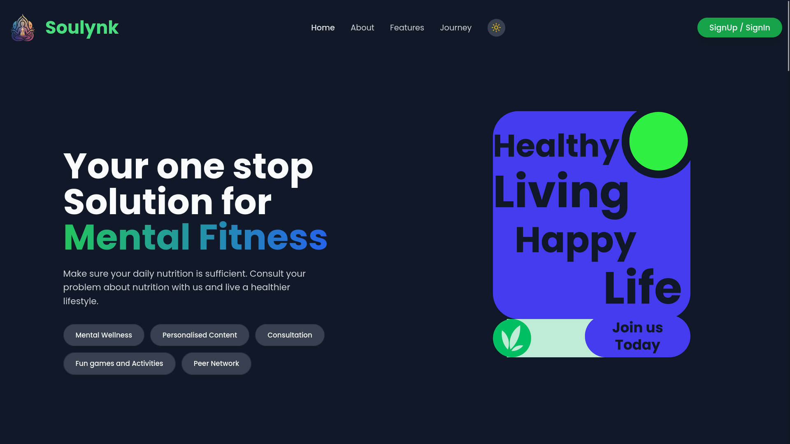

<div align="center">  </div>
<p align="center">
  
</p>
<p align="center">
  
</p>

🔗 Access our innovation here: [Soulynk](https://mindfullweb.netlify.app/) 
<br>
A comprehensive mental health support platform designed to help students, parents, and educators foster better mental well-being through personalized content, peer support, and professional guidance.

## 🌟 Overview

Soulynk is an innovative digital platform that addresses the growing mental health challenges faced by students and professionals across diverse age groups in the digital age. By combining AI-driven personalization, peer support networks, and professional guidance, Soulynk creates a safe and engaging environment for individuals to manage their mental well-being. Originally began as MindFull, the platform evolved into Soulynk, reflecting its deeper purpose of reconnecting the soul with a state of serenity.

## 🎯 Key Features

### Core Platform Features

- **Soulynk Bot**
  - Personalized mental health assistant
  - AI-driven conversational support
  - Guided mindfulness and relaxation exercises
  - Quick resources based on user queries
  - 24/7 availability for immediate help 


- **Personalized Content Delivery**
  - Age-appropriate mental health resources
  - Customized educational materials
  - Adaptive learning paths based on user engagement
  - Interactive activities tailored to individual needs

- **Gamified Mental Health Journey**
  - Achievement-based progress tracking
  - Daily wellness challenges
  - Reward system for consistent engagement
  - Interactive mental health exercises

- **Anonymous Peer Support Network**
  - Safe, moderated discussion forums
  - Experience sharing platforms
  - Peer-to-peer advice systems
  - Community-driven support groups

- **Professional Support Access**
  - Anonymous counseling services
  - Direct access to mental health professionals
  - Crisis intervention resources
  - Scheduled consultation options

### Monitoring & Support Tools

- **Parent Dashboard**
  - Emotional trend monitoring
  - Activity engagement tracking
  - Early intervention alerts
  - Resource recommendations

- **AI-Powered Features**
  - Sentiment analysis
  - Personalized content recommendations
  - Mood prediction
  - Behavioral pattern recognition

## 🔧 Technology Stack

### AI/ML
- Scikit learn
- Numpy
- Pandas
- Tensorflow
- Transformers
- Hugging Face
- Langchain_groq

### Frontend
- React
- Tailwind CSS
- Gradio 

### Backend
- Node.js
- Express
- Flask
- MongoDB (for user and activity data)

### Real-Time Features
- Socket.IO (chat)
- Jitsi Meet

## 🔄 Workflow

1. **User Onboarding**
   - Initial mood assessment
   - Preference collection
   - Interest selection
   - Goals setting

2. **Core Features**
   - Soulynk AI ChatBot
   - Daily activity tracking
   - Mood selection
   - Personalized content delivery
   - Private journaling
   - Community engagement

4. **Support Systems**
   - Progress tracking
   - Badge updates
   - Streak maintenance
   - Notification management

## 🎯 SDG Goals Alignment

### 1. Tackling Depression & Anxiety in Teenagers
- Emotional awareness through journaling
- Pattern identification
- Scenario-based assessment
- Gamified engagement

### 2. Improving Student's State of Mind
- Anonymous peer support network
- Accessible mental health education
- Confidential counseling services
- Stigma reduction initiatives

### 3. Helping Parents Track Mental Health
- Comprehensive parent dashboard
- Early intervention alerts
- Privacy-conscious monitoring
- Resource accessibility

## 🚀 Getting Started

### Prerequisites
```bash
node >= 14.0.0
npm >= 6.0.0
MongoDB >= 4.0.0
```

### Installation
1. Clone the repository
```bash
git clone https://github.com/sankalp-nadiger/MindFull.git
cd mindful-student
```

2. Install dependencies
```bash
npm install
```

3. Set up environment variables
```bash
cp .env.example .env
# Edit .env with your configuration
```

4. Start the development server
```bash
npm run dev
```

## 📝 Contributing

Please read [CONTRIBUTING.md](CONTRIBUTING.md) for details on our code of conduct and the process for submitting pull requests.

## 📄 License

This project is licensed under the MIT License - see the [LICENSE](LICENSE) file for details

## 🤝 Support

For support, reach out to us on email.

---

> "The less harshly we judge ourselves, the more accepting we become to others"
